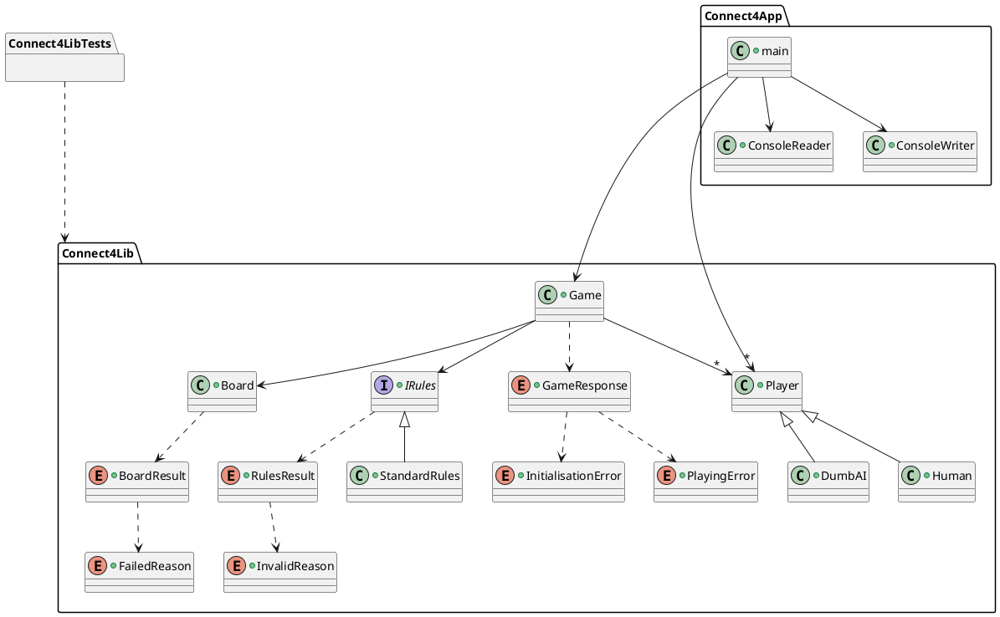

# Connect4

## Overview
This project is a Connect4 game. It is really simple to play, you just have to put your token in the column you want. The first player to align 4 tokens wins. You can play against a friend or against the computer. The computer is really smart :). No, seriously is not. It just plays around the last token played by the player.

## Documentation

## Features
- [x] Play against a friend
- [x] Play against the computer (easy)
- [ ] Play against the computer (hard)
- [ ] Save the game
- [ ] Load a game

## Getting Started
### Prerequisites
All you need is a XCode to run the project. You can download it [here](https://developer.apple.com/xcode/).

### Installing
Just clone the project and open the .xcworkspace file with XCode.
Then, click on the play button in the top left corner of XCode.
> :warning: Don't forget to select the the good scheme. (Connect4App)

## Running the tests
To run the tests, just click on the play button in the top left corner of XCode.
All Model has been tested. with 98.98% of coverage.
> :warning: Don't forget to select the the good scheme. (Connect4Lib)

## Authors
- **Samuel Sirven** 
